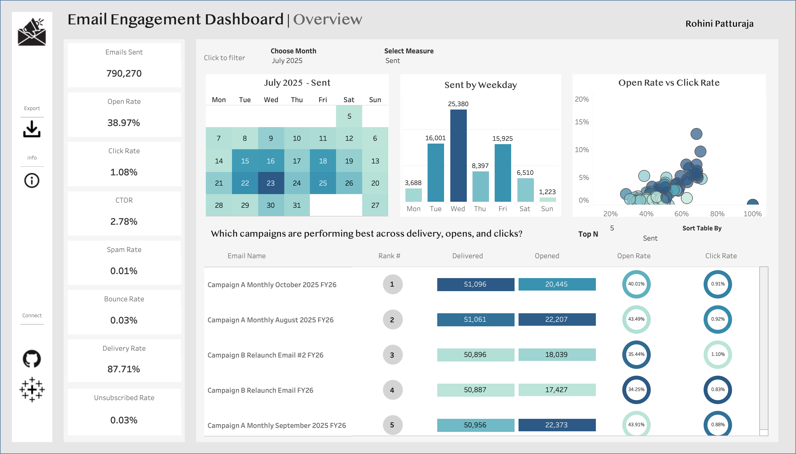

# Email Engagement Analysis & Predictive Modeling

## Project Overview
Every day, millions of emails are sent with the hope of engaging recipients, but most end up unread or ignored. This project analyzes email campaign performance and builds predictive models to optimize user engagement. The objective is to understand **email open and click behavior**, calculate key **marketing KPIs**, and identify **high-potential user segments** for smarter, data-driven targeting. This project analyzes **790,270** email campaigns sent over a two-year period to uncover:

1. Which types of emails resonate most with audiences?
2. When people are most likely to click?
3. How to identify high-engagement users before sending?

When I began analyzing this email engagement data, I expected to uncover a few simple patterns—perhaps certain email types or times of day performing slightly better. What I discovered instead was a **complex and compelling story of user behavior**, shaped by timing, content relevance, and engagement patterns. Each insight revealed not just *what* was happening, but *why*, showing how small strategic changes can significantly improve campaign effectiveness.

---

## Dataset

The dataset used in this project contains detailed logs from email campaigns. It includes the following key columns:

| Column Name             | Description                                                                 |
|-------------------------|-----------------------------------------------------------------------------|
| `Email Address`         | Recipient email address                                                     |
| `Email Name`            | Name of the email campaign                                                 |
| `Email Type`            | Category or type of email (e.g., newsletter, promotion)                    |
| `Delivery Status`       | Status of email delivery (e.g., Delivered, Bounced)                        |
| `Opened`                | Binary flag (1/0) indicating whether the email was opened                  |
| `First Opened UTC`      | Timestamp of the first time the email was opened                            |
| `Last Opened UTC`       | Timestamp of the last time the email was opened                             |
| `Clicked`               | Binary flag (1/0) indicating whether any link in the email was clicked      |
| `First Clicked UTC`     | Timestamp of the first time a link was clicked                               |
| `Last Clicked UTC`      | Timestamp of the last time a link was clicked                                |
| `Marked as spam`        | Binary flag (1/0) indicating if the email was marked as spam                |
| `Unsubscribe`           | Binary flag (1/0) indicating if the recipient unsubscribed                  |
| `Group Unsubscribe`     | Binary flag (1/0) indicating if the recipient unsubscribed from the group   |

> **🔒 Privacy Note:** Email names have been anonymized to preserve organizational confidentiality while maintaining business context.All personally identifiable information (PII) has been removed or masked.

---

## Objectives
- Analyze email campaign performance using core KPIs  
- Identify trends by **email type, time of day, and weekday**  
- Build predictive models to estimate **click probability**  
- Quantify expected performance lift through **targeted emailing**  
- Validate results using **A/B testing methodology**

---

## Methodology

### Data Cleaning & Preparation
- Converted boolean fields (`Opened`, `Clicked`, `Spam`, `Unsubscribe`) to binary values  
- Removed duplicate email records  
- Filtered invalid or inconsistent campaign entries  
- Prepared structured datasets for Tableau and modeling  

---

### Exploratory Data Analysis (EDA)
- Open and click rate analysis by **Email Type**
- Time-based analysis by **hour of day** and **weekday**
- Heatmaps to uncover engagement patterns
- KPI trend analysis across campaigns

---

### KPI Definitions
- **Delivery Rate** = Delivered / Sent  
- **Open Rate** = Opened / Delivered  
- **Click Rate** = Clicked / Delivered  
- **Click-to-Open Rate** = Clicked / Opened
- **Spam Rate** = Spamed / Delivered
- **Unsubsribe Rate** = Unsubscribed / Delivered
- **Engaged Rate** = (Opened or clicked) / Delivered  

---

## Business Questions 

**1. What are the overall email campaign performance metrics, and how do they compare to industry benchmarks?**
   
Based on our analysis of 790,270 emails:

- Email Open Rate: 38.97% of total recipients opened the email
- Click Rate: Approximately 1.08% of total recipients clicked on the link
- Click-to-Open Rate (CTOR): 2.78% of users who opened proceeded to click
- Delivery Rate: 87.71% of emails were successfully delivered
- Engagement Rate: 40.05% of users either opened or clicked

Industry Comparison:

✅ Open Rate (38.97%): Above industry average (15-25%)

❌ Click Rate (1.08%): Below industry average (2-5%)

❌ CTOR (2.78%): Below industry standard (10-15%)

---

**2. Which types of emails perform best?**

- Athletics emails achieve 44% open rates and 2.6% click rates — nearly 3× better than events/fundraising
- This suggests audiences are significantly more engaged with sports-related content
- The gap between categories indicates opportunity to apply athletics' successful elements to underperforming types

**3. When do people actually click?**

- Best Send Time: Afternoon (12-18) generates 4.0% click rate — 5.7× higher than nighttime
- Peak Day/Time Combination: Wednesday afternoon (5.46% click rate)
- Worst Times: Weekend nights and early mornings (0-6) show <1% click rates

**4. What patterns drive engagement?**

- Open rates are relatively consistent across weekdays (~100% baseline)
- Click rates vary dramatically by time of day and day of week
- This indicates timing affects action-taking behavior more than initial interest

**5. Can you build a model to predict which users are most likely to click, and what are the key predictive features?**

Yes, I built a Gradient Boosting model that effectively predicts email click probability.

**Model Performance:**

- ROC AUC Score: 0.9108 (cross-validation), 0.9121 (test set)
- Accuracy: 99.0%
- Best Model: Gradient Boosting outperformed Logistic Regression (0.9022) and Random Forest (0.8801)

**The Silver Lining**: This is actually perfect for our use case! We don't need to predict exact clicks—we need to **rank users and target the most likely clickers**.

---

## Business Impact

### Targeting Strategy
By targeting the **top 30% of users with the highest predicted click probability**:

- **Baseline CTR:** 0.95%  
- **Targeted CTR:** **3.09%**  
- **Relative Improvement:** **225% increase**

This demonstrates that **smart targeting outperforms mass emailing**.We can get the same number of clicks while sending 70% fewer emails, or boost clicks by 3x with the same volume!

---

## A/B Testing Validation
- **Sample size for 80% power:** 340 users per group  
- **Recommended test size:** 5,000 users per group  
- **Statistical power achieved:** 1.0  

This confirms the uplift is **statistically reliable and scalable**.

---

## 📈 Tableau Dashboard
I built a **Tableau dashboard** to make these insights actionable for the marketing team:
**Dashboard Features:**
- Monthly performance calendar(available only for July - Oct 2025) with click heatmap
- Campaign comparison table with visual gauges
- Weekday engagement patterns
- Open rate vs. Click rate scatter plot
- Interactive filters for deep-dive analysis

🔗 **View Dashboard:**  

---

## Key Recommendations
Based on 790,270 emails analyzed, here's what the data tells us to do:

**1. Adopt Probability-Based Targeting**
Use the Gradient Boosting model to rank users by predicted click likelihood and prioritize the top segments rather than emailing the full audience.

**2.Optimize Send Timing**
Schedule campaigns during **afternoon/evening windows**, especially on high-performing weekdays identified in the heatmap analysis.

**3.Leverage High-Performing Email Types**
Apply content patterns from athletics(44% opens, 2.6% clicks) and academic emails to underperforming categories like fundraising and events.

**4.Shift KPIs Beyond Opens**
While open rates are strong, optimization efforts should focus on click behavior, where the largest gains are possible.

**5.Implement Controlled A/B Testing**
Validate model-driven targeting with A/B tests using 340–5,000 users per group to confidently measure lift before scaling.

---

## Conclusion
This project demonstrates that email engagement is not random—it follows clear, learnable patterns driven by content, timing, and user context. By combining rigorous data cleaning, KPI analysis, predictive modeling, and interactive Tableau dashboards, I transformed raw campaign data into a practical decision-making framework.

The results show that smarter targeting—not higher volume—is the key to performance gains. With a 225% projected improvement in click-through rate and a statistically validated testing strategy, this analysis provides a scalable roadmap for turning email campaigns into high-impact engagement channels.

---
## Future Enhancements

 - Natural Language Processing: Analyze subject lines and email body text
 - Churn Prediction: Identify at-risk subscribers before they unsubscribe
 - Multi-Touch Attribution: Track engagement across campaign sequences
 - Real-Time Scoring API: Deploy model as microservice
 - Deep Learning: Experiment with neural networks for personalization
 - Automated Optimization: Reinforcement learning for send-time optimization
 - Sentiment Analysis: Understand tone that drives engagement
 - Image Analysis: Evaluate impact of visual content
--- 

Made with ❤️ and Python | © 2025 [Rohini Patturaja]

⬆ Back to Top
